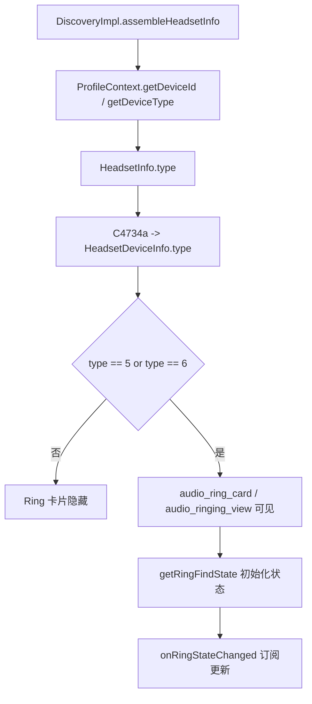

# MiLink 17.2 自定义按钮显示机制与新版故障分析

> 已分析 APK：
>
> - 旧版：`com.milink.service` `17.2.0.0.2512241705`
> - 新版：`com.milink.service` `17.2.4.1.2606161948`
>
> 本文基于 MCP 中 APK 的 JADX 静态分析。旧版与新版的 Ring 实现并不相同，不能混用显示条件、状态码和命令签名。

## 结论

“自定义按钮”不是模块向面板动态插入的 View，而是复用新版已经 inflate 的两个原生 `SynergyView` 卡片。模块只在确认属于目标 OPPO 耳机、且详情页数据类型为 `1` 时改变这两张卡的可见性和内容，不修改设备类型、能力表或设备 ID 映射。

| 设置位置 | 容器 / 控件 ID | 原生 section | 用途 |
|---|---|---|---|
| 上方 | `mi_audio_ring_card` / `mi_audio_ringing_view` | `C6398d1` | 原 MiRing 卡，沿用查找耳机的状态和点击链路。 |
| 下方 | `audio_effect_card` / `audio_effect_view` | `C6440x` | Apple 分支的单开关空间音频卡。 |

`mMiAudioEffectSection`（`C6439w0`）是三按钮空间音频卡，不属于本功能，不能拿它作为下方位置。两个复用卡都通过 `SynergyView.setTitle(int)` 改写标题、可选副标题和图标；模块没有创建第二个按钮。

## 新版 17.2.4.1：自定义按钮不显示的原因

结论：新版 APK 中目标控件、`SynergyView` 类名和 `setFindRing(CirculateServiceInfo, int)` 命令都仍然存在；当前失败点是 **设备类型没有落入 MiRing 卡的显示分支**。

新版 `HeadSetsDetail` 同时维护两张不同的找耳机卡片：

| 卡片 | 控件 ID | section | 原生显示类型 |
|---|---|---|---|
| 普通 AirPods Ring | `audio_ringing_view` | `C6404f1` | `HeadsetDeviceInfo.type == 5 || type == 6` |
| MiRing（当前模块复用目标） | `mi_audio_ringing_view` | `C6398d1` | `HeadsetDeviceInfo.type == 2 || type == 7` |

当前 [`MiLinkServiceHook.kt`](../app/src/main/java/moe/chenxy/oppopods/hook/MiLinkServiceHook.kt) 的 `hookFindRingTitle()` 已正确匹配新版的 `com.miui.circulate.world.sticker.p067ui.SynergyView` 和 `mi_audio_ringing_view`。因此不是新版改包名或改 View ID 导致标题 Hook 失效，而是该 View 根本没有被设为可见。

### 类型链路

新版运行时的数据来源为：

```text
DiscoveryImpl.assembleHeadsetInfo()
  -> ProfileContext.getDeviceId(device)
  -> ProfileContext.getDeviceType(device)
  -> HeadsetInfo.type
  -> HeadsetDeviceManager.convertToBluetoothDevice()
  -> HeadsetDeviceInfo.type
  -> HeadSetsDetail.G()
```

`ProfileContext.getDeviceType()` 会调用 `AbstractC14794a.m51281b(getDeviceId(device))`。当前 Hook 只把 `getDeviceId()` 改为 `FAKE_DEVICE_ID = "01010901"`，但没有改 `getDeviceType()` 或 `HeadsetInfo.getType()`。

在新版 ID 表中，`01010901` 是 K75，位于通用产品名称表；它不属于返回类型 `2`、`7`、`5` 或 `6` 的专用表。因此 `m51281b("01010901")` 的结果为 `0`。`HeadsetDeviceManager.convertToBluetoothDevice()` 会直接调用 `HeadsetInfo.getType()` 并原样写入 `HeadsetDeviceInfo.type`，没有第二次修正机会。

新版 `HeadSetsDetail.G()` 只在类型为 `2` 或 `7` 时调用：

```text
mMiRingCardSection.h(true)
```

其中 `C6398d1.h(true)` 才会把 `mi_audio_ring_card` 和 `mi_audio_ringing_view` 设置为可见。类型 `0` 分支最多更新 MiRing 状态，不会调用该可见性方法，所以卡片保持隐藏，后续的 `SynergyView.setTitle()` 替换也没有可显示的目标。

### 不是根因的兼容点

- 新版 `C6398d1` 的点击仍调用 `HeadsetServiceController.setFindRing(CirculateServiceInfo, int)`，现有控制器签名筛选可以命中该方法。
- 新版 `HeadsetDeviceManager.convertFindRingType()` 会把当前模块的 `103` 转为 UI 的 active 值 `1`，把 `0` 保持为 idle。因此 `0/103/-1` 是新版可接受的输入协议；这一点与旧版 Boolean + `0/1` Ring 回调不同。
- 仅当自定义功能设置为 `NONE` 时，当前 Hook 会返回 `-1`，这是预期的隐藏行为。选择游戏模式、自适应或空间音效时，`activeHandler()` 非空，不会因此隐藏卡片。

### 当前实现：type 1 局部可见性兼容与上/下位置

当前实现不再修改 `ProfileContext.getDeviceType(BluetoothDevice)` 或 `HeadsetInfo.getType()`。对于确认属于 OPPO 目标设备且 `HeadsetDeviceInfo.type == 1` 的新版详情页，`MiLinkServiceHook` 会：

1. 在 `HeadSetsDetail` 完成 section 初始化和附着后，按实际子 View ID 搜索两张卡及其 section；不依赖 section 的混淆类名和字段名。
2. 位置为“上方”时，显示 `mi_audio_ringing_view` 并隐藏 `audio_effect_view`；优先调用 `C6398d1.h(boolean)` 和 `j(int)`，状态统一为 UI 的 `0/1`。
3. 位置为“下方”时，隐藏 MiRing 并显示 `audio_effect_view`；优先调用 `C6440x.m(boolean)` 和 `o(int)`。`o(-1)` 是原生隐藏协议，模块在没有自定义功能时直接隐藏两张卡。
4. 下方卡覆盖 `OnClickListener`，以 300 ms 节流执行 `CustomButtonHandler.onToggle(!isActive())`。同时 Hook 命名明确的 `HeadsetServiceController.setAudioEffect(CirculateServiceInfo, int)`，作为原生点击路径仍然触发时的命令级兜底。
5. 标题 Hook 仅接受已确认的资源对：上方是 `circulate_headset_control_audio_find_earphone` / `...stop_find_earphone`，下方是 `circulate_headset_control_audio_effect_spatial` / `...audio_effect_off`。

稳定性策略是“精确原生方法优先，View 回退第二”：若 `h/j/m/o` 因小版本混淆变化而不可用，仍按实际 ID 直接设置卡片可见性，并尝试 `SynergyView.setState(NORMAL/SUCCESS)` 和标题/副标题/图标更新。找不到目标 View 时只记录日志并跳过，不会更改设备类型。下方卡的直接点击监听以弱引用跟踪，并在 LibXposed 热重载前移除，避免旧 module classloader 被目标 View 保留。这个做法只影响目标详情页，不改 `HeadsetInfo.type`、设备能力表、ANC 分支或电池布局。

如果未来要支持其他类型，优先新增同样受地址和类型限制的局部显示规则；不要把全局设备类型伪装成 `2` 或 `7`。实机验证时应记录 `HeadsetDeviceInfo.type`、两个控件的 `visibility`、标题替换日志、下方点击日志，以及 `setFindRing` / `setAudioEffect` 的状态。

旧版卡片能否出现的决定条件是 `HeadsetDeviceInfo.type`：`HeadSetsDetail` 仅在类型为 `5` 或 `6` 时显示 Ring 卡。实际可点击并调用原生查找耳机命令的则只有类型 `5`。因此，对这个版本而言，稳定显示和可用的最小条件是：目标 OPPO 设备在 MiLink 数据链路中被识别为 `type == 5`，再接管 Ring 的状态与点击命令。



## 旧版原生链路

### 1. 设备类型决定卡片可见性

`DiscoveryImpl.assembleHeadsetInfo()` 构造 `HeadsetInfo` 时会分别写入设备 ID 和设备类型：

```java
new HeadsetInfo(
    address,
    name,
    ProfileContext.getDeviceId(device),
    ...,
    ProfileContext.getDeviceType(device),
    ProfileContext.getSwitchState(address),
    ...
)
```

`ProfileContext.getDeviceType()` 进一步调用 `AbstractC14647a.m51157b(getDeviceId(device))`。随后 `C4734a.m19834e()` 将 `HeadsetInfo.getType()` 原样复制到 `HeadsetDeviceInfo.type`。

`com.miui.circulateplus.world.headset.HeadSetsDetail.m25109A()` 的 AirPods 分支只在以下条件成立时调用 `C6451o0.m25264h(true)`：

```java
headsetDeviceInfo.type == 5 || headsetDeviceInfo.type == 6
```

`m25264h(true)` 同时显示 `audio_ring_card` 和 `audio_ringing_view`；传入 `false` 时则隐藏两者。

类型 `5` 对应 `AbstractC14648b.f43507l` 中的 AirPods ID，例如 `0E20`（AirPods Pro）和 `1420`（AirPods Pro 2）。类型 `6` 对应 AirPods Max ID 表。虽然 `type == 6` 也能显示卡片，`C4737b0` 的 `m19876K`、`m19890m`、`m19893y` 和 `m19886c0` 都要求 `type == 5`，所以 `type == 6` 的 Ring 卡在此版本中不能作为完整的可点击复用目标。

### 2. 原生控件和文案更新

`C6451o0` 的构造函数通过 `HeadSetsDetail.findViewById()` 获取：

```java
audio_ring_card
audio_ringing_view  // SynergyView
```

它维护 Normal、Loading、Success 状态。`m25259i()` 在状态变化时调用：

```java
synergyView.setIcon(...);
synergyView.setTitle(...);
```

Normal 使用“查找耳机”资源，Success 使用“停止查找耳机”资源。新版模块在 `SynergyView.setTitle(int)` 前拦截时，仍严格以 View ID 和资源名配对；上方匹配 `mi_audio_ringing_view`，下方另匹配 `audio_effect_view` 的空间音频资源。因此不会误改其他 `SynergyView`，旧版分析本身仍只适用于 `audio_ringing_view`。

### 3. 初始状态和实时状态

`HeadSetsDetail.m25109A()` 会调用：

```text
C4737b0.m19876K()
  -> HeadsetServiceClient.headsetGetRingStatus()
  -> MxBluetoothManager.getRingFindState(address): Boolean
```

返回 `true` 时卡片进入 `SUCCESS`，返回 `false` 时进入 `NORMAL`。

面板附着后，`HeadSetsDetail.onAttachedToWindow()` 对 `type == 5/6` 调用 `C4737b0.m19887d0()`，最终执行 `HeadsetServiceClient.addRingCallback()`。其 `MxBluetoothManager.MMACallback.onRingStateChanged(device, active)` 会对所有 Ring 回调调用：

```text
active == true  -> onResult(1)
active == false -> onResult(0)
```

`C6451o0.e.onResult()` 再调用 `C6451o0.m25263g(int)`；该方法只有输入 `1` 会切换到 `SUCCESS`，其他值都会回到 `NORMAL`。因此这个 APK 的 UI 状态协议是严格的 `0/1`，不是 `103` 或其他 find-ring 状态码。

### 4. 点击命令

卡片点击逻辑在 `C6451o0.m25257b()`：

| 当前 UI 状态 | 原生动作 |
|---|---|
| `NORMAL` | 先由 `C4737b0.m19890m()` 检查是否正在佩戴；若未佩戴则调用 `m19893y()` 开始响铃，若正在佩戴则弹确认框。 |
| `SUCCESS` | 调用 `C4737b0.m19886c0()` 停止响铃。 |
| `LOADING` | 忽略再次点击，等待状态回调。 |

实际命令最终是：

```text
start: MxBluetoothManager.ringFindForAirPods(address, true)
stop:  MxBluetoothManager.ringFindForAirPods(address, false)
```

这两条命令均受 `HeadsetDeviceInfo.type == 5` 限制。

### 5. 面板关闭行为

旧版 `HeadSetsDetail.onDetachedFromWindow()` 对 Ring 卡做的是：

```text
C4737b0.m19889f0()
  -> HeadsetServiceClient.removeRingCallback()
```

也就是注销回调，不会调用 `headsetStopRing()`。因此，在该 APK 中关闭面板本身不应触发“停止查找耳机”的命令；不要把这一版本的生命周期行为与新版 `setFindRing(...)` 路径混在一起。

## 当前模块与旧版的对应关系

当前实现的功能选择位于 [`CustomButtonFunction.kt`](../app/src/main/java/moe/chenxy/oppopods/pods/CustomButtonFunction.kt)，并由 [`MiLinkServiceHook.kt`](../app/src/main/java/moe/chenxy/oppopods/hook/MiLinkServiceHook.kt) 的 `CustomButtonHandler` 统一分发。

| 当前实现 | 在旧版 17.2 中的作用 | 结论 |
|---|---|---|
| `MxBluetoothManager.getRingFindState(String)` 返回 `miLinkFindRingActive()` | 对应旧版初始状态读取。 | 兼容，但应返回布尔状态。 |
| `SynergyView.setTitle(int)` 替换标题/图标/副标题 | 对应 `audio_ringing_view` 的原生渲染时机。 | 兼容，且这是正确的改文案入口。 |
| `FAKE_DEVICE_ID = "01010901"` | 在本 APK 的 ID 表中是 K75，位于通用设备名称表。 | 不会命中 type 5/6 的 AirPods 表，静态推导结果为 `type == 0`，不能单独让旧版 Ring 卡显示。 |
| `AncBatteryController.setFindRing(...)` | 此 APK 的 `AncBatteryController` 中没有这个方法。 | Hook 会因找不到方法而跳过，不能承接旧版 Ring 点击。 |
| 反射查找 `CompletableFuture(CirculateServiceInfo, int)` 的控制器方法 | 旧版 Ring 的实际方法为 `void m19893y(HeadsetDeviceInfo)` 和 `void m19886c0(HeadsetDeviceInfo)`。 | 当前反射筛选不会命中旧版的开始/停止命令。 |
| `miLinkFindRingState()` 返回 `0/103/-1` | 旧版 Ring 视图由 `getRingFindState(): Boolean` 与回调 `onResult(0/1)` 驱动。 | `103` 和 `-1` 不是此版本 Ring UI 的状态协议。 |
| `HeadSetsDetail.onDetachedFromWindow()` 的 stop 抑制 | 旧版 detach 只取消订阅。 | 对旧版不是必要的稳定性措施；需按版本隔离。 |

因此，当前标题替换已经准确定位到旧版的原生控件，但静态代码表明它不能仅靠现有的 K75 假 ID 稳定制造该控件。若实机观察到卡片出现，需要记录运行时实际的 `HeadsetInfo.type`，确认是否有其他 Hook、缓存或系统侧逻辑将目标设备变成了 `type == 5`。

## 面向旧版 17.2 的兼容策略

以下是针对这个 APK 的实现方向，本文不直接修改 Hook：

1. 只对已确认的 OPPO 目标设备，将 `ProfileContext.getDeviceType(BluetoothDevice)` 或 `HeadsetInfo.getType()` 伪装为 `5`。
   直接伪装类型比替换为 AirPods ID 更可控，避免 ID 表变化同时影响机型名称、ANC 能力和其他卡片分支。

2. 接管 `MxBluetoothManager.ringFindForAirPods(String, boolean)`：
   `true` 转发为当前自定义功能的启用动作，`false` 转发为停用动作；阻止原生 AirPods 命令继续下发。

3. 维持旧版的状态协议：
   `getRingFindState(String)` 返回自定义功能的布尔状态；状态变化后让已注册的 Ring 回调得到 `onResult(1)` 或 `onResult(0)`。不要向 `C6451o0.m25263g()` 传递 `103`。

4. 保留现有的 `SynergyView.setTitle(int)` Hook，但继续严格限定：
   - view ID 为 `mi_audio_ringing_view`
   - 资源名为 `circulate_headset_control_audio_find_earphone` 或 `circulate_headset_control_audio_stop_find_earphone`

5. `NONE` 选项应在旧版直接调用/Hook `C6451o0.m25264h(false)`，或在 `HeadSetsDetail.m25109A()` 的可见性判断处关闭 Ring 卡；不能依赖 `getFindRingState` 返回 `-1` 隐藏，因为这个版本读取的是布尔值。

6. 为此版本单独做方法签名匹配。不要把新版的 `AncBatteryController.setFindRing(BluetoothDevice, int)`、`CompletableFuture(CirculateServiceInfo, int)` 或 detach stop 抑制当成旧版 Ring 链路的一部分。

## 建议的实机验证

在 HyperOS Android 15+ 的 LSPosed 设备上，针对 `com.milink.service` 检查以下事件：

1. `DiscoveryImpl.assembleHeadsetInfo()` 产出的 `HeadsetInfo.type` 是否为 `5`。
2. `HeadSetsDetail.m25109A()` 是否调用 `C6451o0.m25264h(true)`，且 `audio_ring_card` 可见。
3. 打开面板时 `getRingFindState(address)` 是否返回当前自定义功能状态。
4. 点击卡片时是否命中 `ringFindForAirPods(address, true/false)`，而不是依赖不存在的 `AncBatteryController.setFindRing(...)`。
5. 外部状态变化后是否触发 `onRingStateChanged`，并最终向 UI 传入 `1` 或 `0`。
6. 关闭面板后是否只注销 Ring callback，而没有发送自定义功能的关闭命令。

这些检查能把“卡片显示”“标题替换”“点击转发”“状态回写”分开验证，避免其中一个环节成功时掩盖其他环节的版本不兼容。
